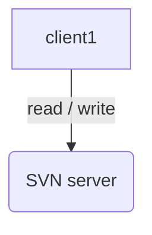

# 简介 #

<small>本篇介绍一个简单例子，从开始到结束</small>

[参考链接](http://freesoftwaremagazine.com/articles/"automatically_writing_makefiles_with_autotools")

[automake官方][id1]

[autoconf官方][id2]

## 第一个简单例子 ##

第一个小例子当然是helloworld. 

### configure.ac ###


AC_PREREQ([2.69])
AC_INIT([hello], [1.0], [panzehua1@huawei.com])
AM_INIT_AUTOMAKE([-Wall -Werror foreign])
# AC_CONFIG_SRCDIR([src/main.c])
AC_CONFIG_HEADERS([config.h])
...


<small>如果你有自己的m4宏，即aclocal.m4,可以重命名为acinclude.m4，则会自动被包含进aclocal.m4中</small>


mv aclocal.m4 acinclude
aclocal
autoconf


然后写Makefile.am,告诉automake要生成什么，怎么生成

[id1]: https://www.gnu.org/software/automake/
[id2]: https://www.gnu.org/software/autoconf/autoconf.html
